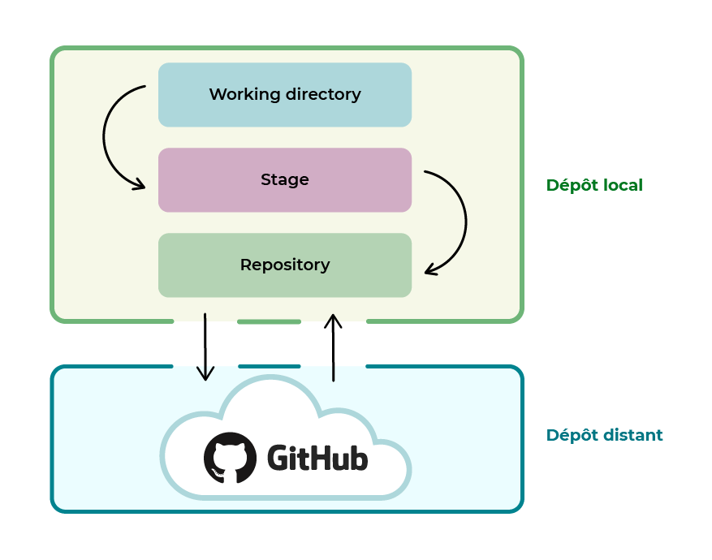

```txt
 L'image ci-dessus décris le focntionnement de git 
     il est composé de 2 couches principales:
     - la couche une  qui represente le dépot local,(git)
     - la deuxième couche  qui represente le dépôt distant (github)
```
**fonctionnement**

1. initialiser le depôt local
     - Le working directory
          le dossier du projet sur votre ordinateur
2. ajouter les modifications (fichier créés, codes ajoutés ...) par la commande : 
```bash
     git add
```
cette étape est appelée 
 -stage ou index
     Cette zone est un intermédiaire entre le working directory et le repository. 

3. Le repository
 on peut alors sauvegarder la version de nos modification grâce à  
 Git, c'est-à-dire la stocker dans le repository.
 ceci se fait par la comande :

 ```bash
     git commit -m "commentaire"
```

vous remarqurez qu'aprés la commande git commit on a ajouter -m et deux guillemets pour mettre un commentaire, **-m** est ici ce qu'on appel un argument de la commande principale **git commit** pour ajouter un message ou commentaire. Et ce qui ce touve entre les gueillemets est votre commentaire 😈  

-**Alors essayons d'envoyer notre depôt local en ligne (vers github)**

bein évidement il faut qu'on prepare le depôt distant pour qu'il puisse recevoir l'offrande 😍 

lets go look the next chapiter 🏃‍♂️ 
