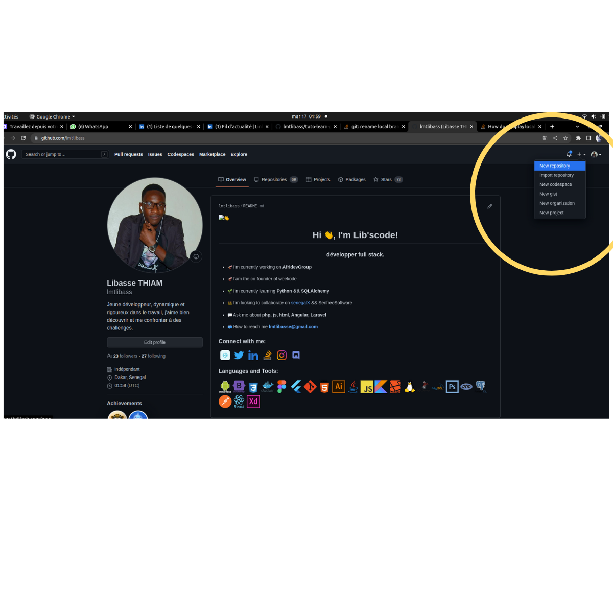

# Pousser votre dépôt locale vers github

- **C'est simple broh 😺** 

1. aller dans github
2. créer un nouveau reposuitory 

3. copier et coller si vous voulez ligne par ligne, les commandes qui se trouvent dan sla partie 

.. or create a new repository on the command line 


La commande  
```bash
     git push -u origin main
```
vous a permis de pousser le dépôt locale en ligne, 
dans la branche main 


 - Pour t'emmerder et me simplifier la vie 😻 :

 **Je t'invite à creuser sur les autre commandes et sur la notion de branche** !! 

 aprés cela reviens me remercier 😈 


 # Une petite récap

 - **git add** pour d’ajouter des fichiers dans le stage, qui est une zone intermédiaire dans laquelle stocker les fichiers modifiés.

- **git commit** pour créer une nouvelle version avec les fichiers situés dans l’index.

- **git commit -m** pour  créer une nouvelle version et de préciser le message rattaché au commit.

- **git push** pour envoyer les modifications faites en local vers un dépôt distant. 


⏩ 